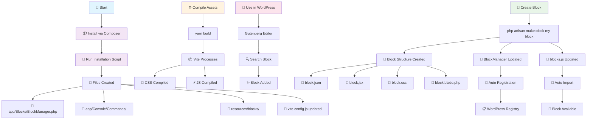
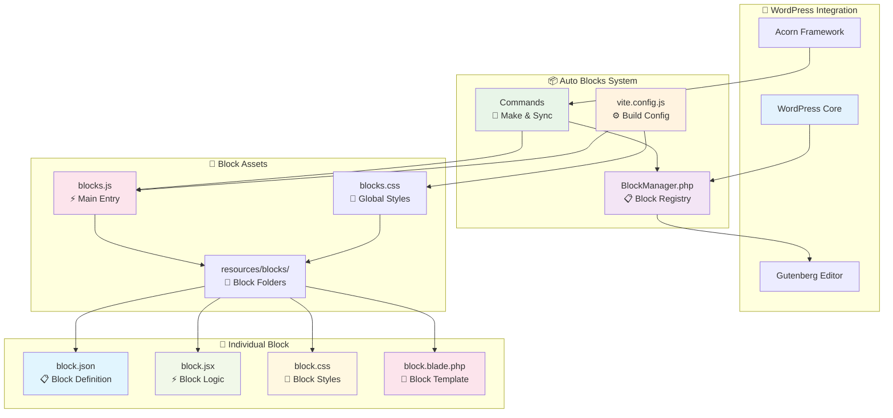
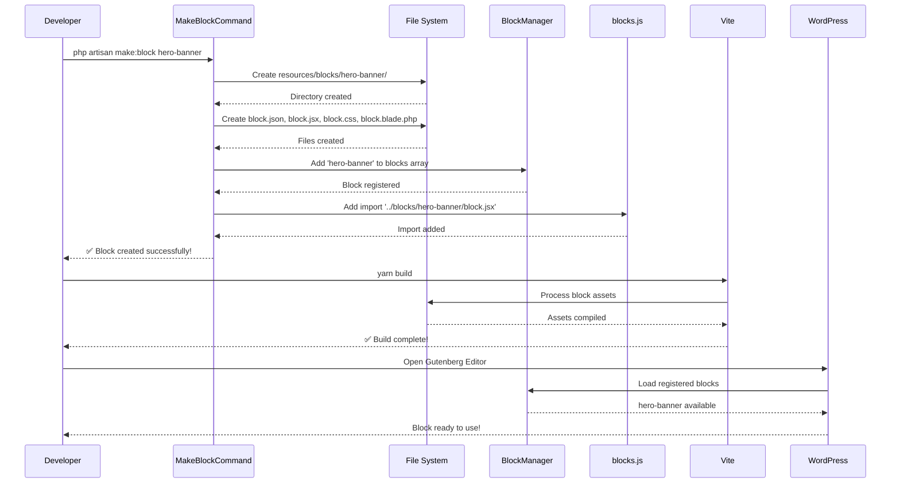
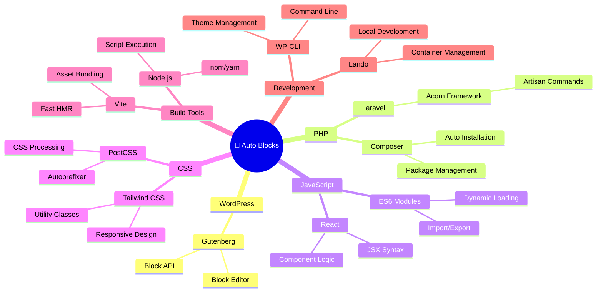
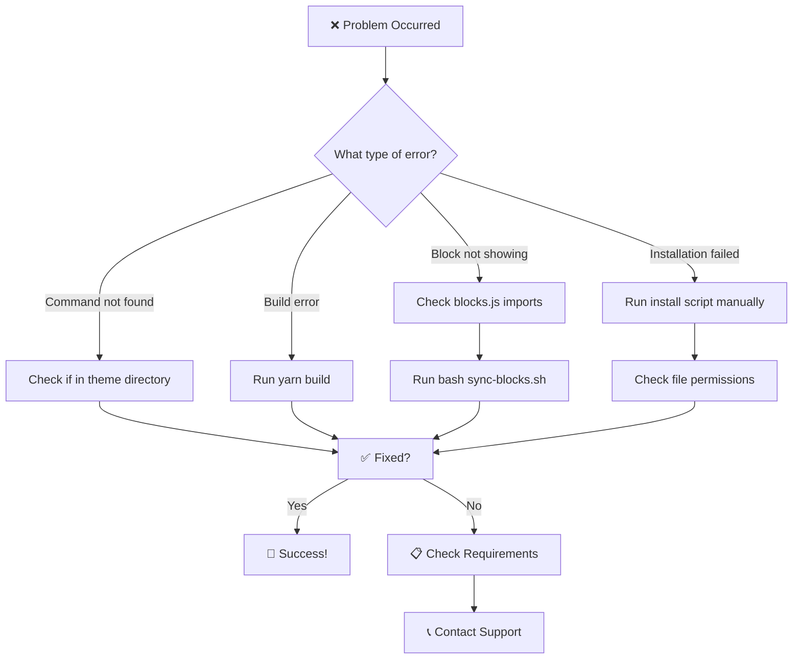

# 🎨 Auto Blocks - Gutenberg Block System for Sage/Acorn

Complete system for creating custom Gutenberg blocks in WordPress themes using Sage/Acorn + Laravel.

## � System Flow



## �🚀 Installation

### Prerequisites
- WordPress 6.0+
- Sage/Acorn theme
- PHP 8.0+
- Node.js and npm

### 1. Install via Composer
```bash
composer config repositories.auto-blocks vcs https://github.com/Juliojar4/Auto-Blocks.git
composer require juliojar4/auto-blocks:dev-master
```

### 2.  Add files

Run the manual installation script:

```bash
bash vendor/juliojar4/auto-blocks/install-auto-blocks.sh
```

### 3. Environment-specific commands

**🐳 With Lando (detects .lando.yml):**
```bash
lando wp acorn make:block block-name
```

**💻 Direct WP-CLI:**
```bash
wp acorn make:block block-name
```

## 🚀 Quick Usage

### Create a new block:
Run in your theme
```bash
# With Lando
lando wp acorn make:block my-block

# Without Lando  
wp acorn make:block my-block
```

### Compile assets:
```bash
npm run build
# or
yarn build
```

### Verify created blocks:
```bash
# Sync existing blocks (Acorn command)
lando wp acorn blocks:sync

# Verify system installation
bash verify-system.sh
```

## 📁 Created Structure

After installation, the following files and directories will be created:

```
📁 app/
  📁 Blocks/
    📄 BlockManager.php           # Block manager
  📁 Console/
    📁 Commands/
      📄 MakeBlockCommand.php     # Command to create blocks
      📄 SyncBlocksCommand.php    # Command to synchronize
  📄 setup.php                    # BlockManager integration (added)

📁 resources/
  📁 blocks/                      # Directory for custom blocks
  📁 views/
    📁 blocks/                    # Blade templates for blocks
  📁 js/
    📄 blocks.js                  # Main JavaScript for blocks
    📄 app.js                     # Frontend JavaScript entry point
    📄 editor.js                  # Editor JavaScript entry point
  📁 css/
    📄 blocks.css                 # Block styles
  📄 blocks.php                   # PHP block configuration

📄 vite.config.js                 # Vite configuration (updated)
📄 sync-blocks.sh                # Script to sync imports
📄 verify-system.sh              # Script to verify installation
```

## 🏗️ Architecture Diagram



## 🎯 Usage Example

### 1. Create a block
```bash
lando wp acorn make:block promotional-banner
```

### 2. Compile
```bash
yarn build
```

### 3. Use in WordPress
- BlockManager will be automatically registered in WordPress
- Go to the block editor
- Search for "Promotional Banner"
- Add and configure!

## 📈 Block Creation Flow



## 🔧 Available Commands

```bash
# Create simple block
lando wp acorn make:block block-name

# Sync existing blocks (Acorn command)
lando wp acorn blocks:sync

# Sync imports in blocks.js (bash script)
bash sync-blocks.sh

# Verify complete installation
bash verify-system.sh
```

## ⚠️ Common Issues and Solutions

### 1. Error "Could not open input file: artisan"
**Solution:** Use `lando wp acorn` instead of `php artisan`

### 2. Error in vite.config.js with glob
**Solution:** Already fixed in current version. If it happens, reinstall.

### 3. Error "Could not resolve entry module"
**Solution:** Run `yarn build` after creating blocks

### 4. Installation scripts didn't run
**Solution:** Manually run one of the installation scripts

### 5. Command make:block not found
**Solution:** Check if you're in the theme directory and Acorn is configured

### 6. Block created but doesn't appear in editor
**Solution:** The import wasn't automatically added to blocks.js:
```bash
# Run the automatic synchronizer
bash sync-blocks.sh

# Then compile
yarn build
```

### 7. Verify if everything is working correctly
**Solution:** Run the complete verification script:
```bash
bash verify-system.sh
```

## 📋 Requirements

- ✅ WordPress with Sage/Acorn theme
- ✅ PHP 8.0+
- ✅ Node.js and npm/yarn
- ✅ Composer
- ✅ WP-CLI (recommended)
- ✅ Lando (optional, but recommended)

## 🛠️ Technology Stack



## 🆘 Support

If you encounter issues:

1. ✅ Check if you're in the theme root directory
2. ✅ Confirm that Sage/Acorn is configured
3. ✅ Run the manual installation scripts
4. ✅ Verify that all files were created
5. ✅ Run `yarn build` after changes

## 🔍 Troubleshooting Guide



## 🎉 Result

After successful installation, you will have:

- ✅ Complete block creation system
- ✅ Automated templates
- ✅ Automatic asset compilation
- ✅ Perfect Gutenberg integration
- ✅ Tailwind CSS support
- ✅ Hot reload during development

---

**Developed by Julio Jara**  
🔗 [GitHub](https://github.com/Juliojar4/Auto-Blocks)
